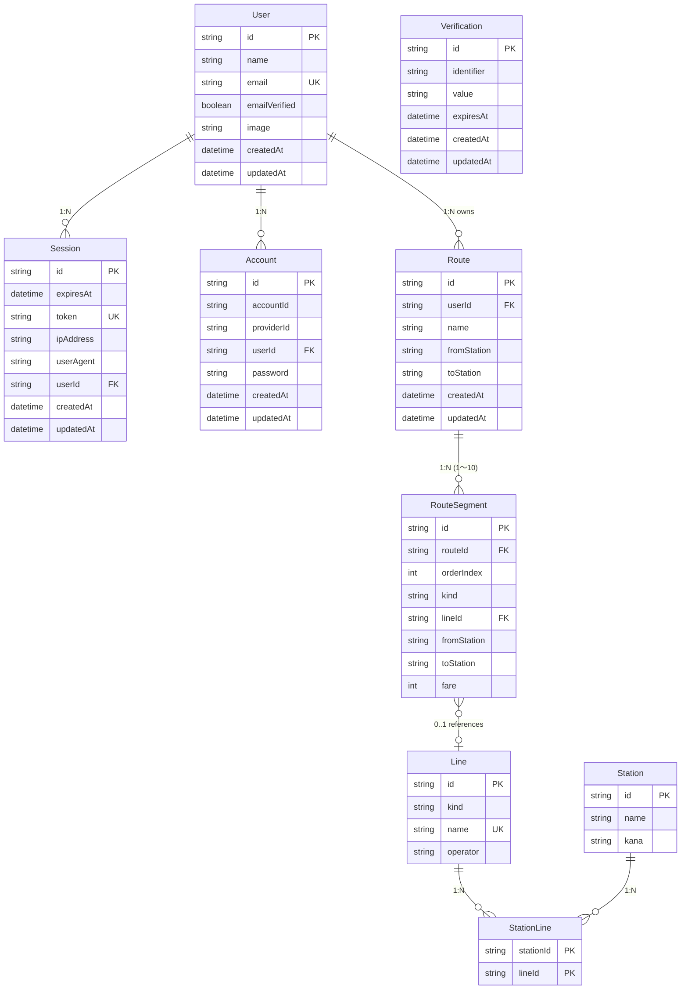

# データモデル設計

## 1. 目的とスコープ

[requirements.md](requirements.md) (US-001〜US-007) と [ui.md](ui.md) に定義された画面・機能要求を満たすための、永続データモデルを定義する。永続化基盤は **SQLite + Prisma 6** ([../backend/prisma/schema.prisma](../backend/prisma/schema.prisma)) を用い、認証は **better-auth** が要求する4テーブル (User / Session / Account / Verification) を含む。

ドメインの中心は **Route** (1経路) で、その明細を **RouteSegment** が複数件 (1〜10) で構成する。区間は外部マスタ **Line** (路線) を任意で参照し、駅選択用に **Station** (駅 / 停留所) マスタも併設する。Station と Line は M:N で **StationLine** 中間テーブルで結ばれる。

本書では以下を扱う:

- ER 図 (Mermaid 記法)
- 各エンティティの列定義と制約
- 主キー / 外部キー / 索引 / カスケード方針
- 派生・計算項目のルール
- 既存 Prisma スキーマとの差分と次マイグレーション計画
- ライフサイクル (作成・更新・削除)

スコープ外: API エンドポイント設計、フロントエンドの状態管理、ディレクトリ構造は別ドキュメント ([ui.md](ui.md) や [docs/adr/](adr/)) で扱う。

---

## 2. ER 図



> Verification は他テーブルと直接的なリレーションを持たないため矢印なしで掲載 (better-auth がメール認証 / パスワードリセット用途で内部的に発行・検証する一時レコード)。MVP では未使用。

---

## 3. エンティティ詳細

各エンティティの列・型・制約と説明。`?` 接尾辞は nullable、`UNIQUE` は一意制約、`PK`/`FK` は主キー/外部キーを示す。

### 3.1 認証系 (better-auth 必須テーブル)

これらは better-auth の prismaAdapter が要求するスキーマに従う。アプリ側で直接 INSERT/UPDATE するのは User の補助情報のみで、Session / Account / Verification は better-auth が管理する。

#### 3.1.1 User

| 列 | 型 | 制約 | 説明 |
| --- | --- | --- | --- |
| id | string | PK | better-auth が発行する識別子 |
| name | string | required | 表示名。MVP ではサインアップ時に email を流用 |
| email | string | UNIQUE, required | ログインID。RFC5322 形式 |
| emailVerified | boolean | required | メール認証完了フラグ。MVP ではメール認証未実装のため常に `false` |
| image | string? | nullable | プロフィール画像URL (将来用) |
| createdAt | datetime | required | 作成時刻 |
| updatedAt | datetime | required | 更新時刻 |

リレーション: 1ユーザは多 Session / 多 Account / 多 Route を保持。

関連US: US-001 (新規登録) / US-002 (ログイン)。

#### 3.1.2 Session

| 列 | 型 | 制約 | 説明 |
| --- | --- | --- | --- |
| id | string | PK | セッションID |
| expiresAt | datetime | required | 有効期限 |
| token | string | UNIQUE, required | クライアント Cookie に格納するトークン (HttpOnly) |
| ipAddress | string? | nullable | クライアントIP |
| userAgent | string? | nullable | UA 文字列 |
| userId | string | FK → User.id, ON DELETE CASCADE | 所有者 |
| createdAt / updatedAt | datetime | required | 監査用 |

ライフサイクル: ログイン成功時に発行、明示ログアウトまたは期限切れで削除。User 削除時はカスケード削除。

#### 3.1.3 Account

| 列 | 型 | 制約 | 説明 |
| --- | --- | --- | --- |
| id | string | PK | |
| accountId | string | required | プロバイダ内のアカウントID。Email/Password 認証では User.id と同値 |
| providerId | string | required | 認証プロバイダ識別子。Email/Password 認証では `"credential"` |
| userId | string | FK → User.id, ON DELETE CASCADE | 紐づくユーザ |
| password | string? | nullable | ハッシュ済パスワード (Email/Password 認証時のみ設定) |
| accessToken / refreshToken / idToken | string? | nullable | OAuth プロバイダ用 (MVP 未使用) |
| accessTokenExpiresAt / refreshTokenExpiresAt | datetime? | nullable | 同上 |
| scope | string? | nullable | 同上 |
| createdAt / updatedAt | datetime | required | |

#### 3.1.4 Verification

| 列 | 型 | 制約 | 説明 |
| --- | --- | --- | --- |
| id | string | PK | |
| identifier | string | required | 検証対象 (email アドレス等) |
| value | string | required | 検証コード or トークン |
| expiresAt | datetime | required | 有効期限 |
| createdAt / updatedAt | datetime? | nullable | |

将来のメール認証 / パスワードリセット用。MVP では発行されない。

---

### 3.2 ドメインモデル

#### 3.2.1 Route

ユーザが登録する1つの通勤経路。

| 列 | 型 | 制約 | 説明 |
| --- | --- | --- | --- |
| id | string | PK, default `cuid()` | |
| userId | string | FK → User.id, ON DELETE CASCADE | 所有者 (オーナー) |
| name | string? | nullable, max 50 | 経路名。空または NULL 時は UI で「(無題)」表示 |
| fromStation | string | required, max 50 | **派生**: `routeSegments[orderIndex最小].fromStation`。サーバ保存時に算出 |
| toStation | string | required, max 50 | **派生**: `routeSegments[orderIndex最大].toStation`。サーバ保存時に算出 |
| createdAt | datetime | default `now()` | 作成時刻 |
| updatedAt | datetime | auto update | 更新時刻。楽観ロック値としても使用 |

派生フィールド (`fromStation` / `toStation`) はクライアントから受信した segments の端点から算出して保存する。読み取り時は保存値をそのまま返却 (再計算しない)。

リレーション: 1経路は 1〜10件の RouteSegment を持つ。

関連US: US-003 (登録) / US-004 (一覧) / US-005 (詳細) / US-006 (編集) / US-007 (削除)。

#### 3.2.2 RouteSegment

経路を構成する1つの区間。現在の Prisma スキーマ上の `Segment` を **`RouteSegment`** にリネームし、`kind` / `lineId` を追加する想定 (詳細は §6)。

| 列 | 型 | 制約 | 説明 |
| --- | --- | --- | --- |
| id | string | PK, default `cuid()` | |
| routeId | string | FK → Route.id, ON DELETE CASCADE | 所属経路 |
| orderIndex | int | required, 1始まり | 経路内の区間順序 |
| kind | string (enum) | required, in `{train, subway, bus, other}` | 種別。表示色分けタグに対応 |
| lineId | string? | FK → Line.id, ON DELETE SET NULL, nullable | 路線参照 (任意)。「(未選択)」or「その他」の場合は null |
| fromStation | string | required, max 50 | 区間出発駅。Station マスタを参照しないフリー文字列 (UI からのフリー入力許容のため) |
| toStation | string | required, max 50 | 区間到着駅。同上 |
| fare | int | required, 1〜99,999 | 区間運賃 (円) |

索引: `(routeId, orderIndex)` の複合索引で順序付き取得を高速化。

設計上の判断:

- **fromStation / toStation を FK にしない理由**: ui.md / 経路登録の仕様で「マスタに無い駅をフリー入力で登録することを許容」と決めているため、参照整合性より入力の自由度を優先する
- **lineId を FK にする理由**: ui.md / 経路登録の仕様で路線名はマスタからの選択形式と決めているため、参照整合性を担保する。`null` は「未選択」or「その他」を表す

#### 3.2.3 Line (路線マスタ)

路線情報のマスタ。経路登録/編集の路線セレクトと、駅マスタ参照の路線フィルタの両方で参照される。

| 列 | 型 | 制約 | 説明 |
| --- | --- | --- | --- |
| id | string | PK | 路線ID (例: `jr-yamanote`)。手動採番のスラッグ形式を想定 |
| kind | string (enum) | required, `{train, subway, bus, other}` | 種別 |
| name | string | UNIQUE, required, max 50 | 路線名 (例: `JR山手線`) |
| operator | string? | nullable, max 50 | 事業者名 (例: `JR東日本`) |

データ投入: 初期は seed スクリプトで [screen_design_route_register.md](ui-screens/screen_design_route_register.md) §3.3 の固定リストを投入。将来は管理画面 or オープンデータ取込で拡張。

#### 3.2.4 Station (駅 / 停留所マスタ)

駅 / 停留所のマスタ。駅マスタ参照画面 ([screen_design_station_master.md](ui-screens/screen_design_station_master.md)) で検索される。

| 列 | 型 | 制約 | 説明 |
| --- | --- | --- | --- |
| id | string | PK, default `cuid()` | |
| name | string | required, max 50 | 駅名 / 停留所名 |
| kana | string | required, max 50 | ひらがな読み |

種別 (kind) は Station 自体には保持しない。接続する Line(s) の `kind` から派生して画面表示する (1駅が複数の種別をまたがる場合 [例: 新宿駅 = train + subway 接続] にタグを複数表示できる)。

データ投入: 初期は seed スクリプト。将来は国交省オープンデータ等から取込。

#### 3.2.5 StationLine (Station ↔ Line 中間テーブル)

駅と路線の M:N リレーションを表現する junction テーブル。

| 列 | 型 | 制約 | 説明 |
| --- | --- | --- | --- |
| stationId | string | PK (composite), FK → Station.id, ON DELETE CASCADE | |
| lineId | string | PK (composite), FK → Line.id, ON DELETE CASCADE | |

主キーは `(stationId, lineId)` の複合キー。逆引き索引として `[lineId]` も追加。

---

## 4. 主キー・外部キー・索引方針

### 4.1 主キー

| エンティティ | 主キー | 採番 |
| --- | --- | --- |
| User / Session / Account / Verification | id | better-auth が発行する文字列 ID |
| Route / RouteSegment / Station | id | Prisma `@default(cuid())` |
| Line | id | 手動 (スラッグ形式 `jr-yamanote` 等) |
| StationLine | (stationId, lineId) | 複合主キー |

### 4.2 外部キーとカスケード方針

| 子 | 親 | カラム | カスケード | 意図 |
| --- | --- | --- | --- | --- |
| Session | User | userId | ON DELETE CASCADE | ユーザ削除時に全セッションを破棄 |
| Account | User | userId | ON DELETE CASCADE | ユーザ削除時に認証情報を破棄 |
| Route | User | userId | ON DELETE CASCADE | ユーザ削除時に経路を巻き取って削除 |
| RouteSegment | Route | routeId | ON DELETE CASCADE | 経路削除時に区間を全削除 |
| RouteSegment | Line | lineId (nullable) | ON DELETE SET NULL | マスタの路線が消えても区間レコード自体は保護 |
| StationLine | Station | stationId | ON DELETE CASCADE | 駅削除時に対応する路線リンクを破棄 |
| StationLine | Line | lineId | ON DELETE CASCADE | 路線削除時に対応する駅リンクを破棄 |

### 4.3 索引

| テーブル | 索引 | 種別 | 用途 |
| --- | --- | --- | --- |
| User | email | UNIQUE | ログイン |
| Session | token | UNIQUE | Cookie 検証 |
| Line | name | UNIQUE | 路線名重複防止 |
| RouteSegment | (routeId, orderIndex) | 複合 | 順序付き取得 |
| StationLine | (stationId, lineId) | PK | M:N 走査 |
| StationLine | lineId | 単一 | 路線→駅の逆引き |

---

## 5. 派生・計算項目

UI で「派生」または「集計」と扱われる項目の算出ルール。永続化するもの (`Route.fromStation` 等) と、毎回算出するもの (合計運賃 等) を区別する。

| 項目 | 算出ルール | タイミング | 永続化 |
| --- | --- | --- | --- |
| `Route.fromStation` | `routeSegments[orderIndex 最小].fromStation` | サーバの POST/PATCH 受信時 | ✅ Route テーブル |
| `Route.toStation` | `routeSegments[orderIndex 最大].toStation` | 同上 | ✅ Route テーブル |
| 合計運賃 | `Σ routeSegments[].fare` | クライアント側 (一覧/詳細表示時) | ❌ 都度算出 |
| 種別タグ集合 | `routeSegments[].kind` のユニーク集合 | クライアント側 (一覧表示時) | ❌ 都度算出 |
| 路線サマリ | `RouteSegment.line.name` のユニーク集合 | クライアント側 (一覧表示時) | ❌ 都度算出 |
| Station の表示種別 | StationLine 経由で接続する Line.kind の集合 | クライアント側 (駅マスタ参照表示時) | ❌ 都度算出 |

---

## 6. 既存 Prisma スキーマとの差分

[../backend/prisma/schema.prisma](../backend/prisma/schema.prisma) の現状 (初回マイグレーション `20260427032425_init`) からの差分と、次マイグレーションで適用する変更。

### 6.1 変更点

1. **`Segment` を `RouteSegment` にリネーム**
   - テーブル名・モデル名・リレーション名を変更
2. `RouteSegment` に列追加
   - `kind String` (enum 制約はアプリ層 zod でバリデーション)
   - `lineId String?` + `Line` への外部キー (ON DELETE SET NULL)
3. **`Line` テーブル新設** (id / kind / name / operator)
4. **`Station` テーブル新設** (id / name / kana)
5. **`StationLine` テーブル新設** (stationId / lineId 複合PK)
6. `Route.fromStation` / `Route.toStation` の **意味を「ユーザ入力」から「派生 (segments の端点から算出)」** に変更
   - テーブル定義 (列・型) は無変更
   - アプリ側ハンドラに算出ロジックを追加するのみ

### 6.2 適用手順 (次マイグレーション)

```bash
# 1. backend/prisma/schema.prisma を上記変更に合わせて編集
# 2. マイグレーション生成・適用
pnpm --filter backend exec prisma migrate dev --name add_line_station_kind
# 3. seed スクリプト作成 (初期 Line / 代表 Station / StationLine)
pnpm --filter backend exec prisma db seed
```

### 6.3 影響範囲

- [../backend/prisma/schema.prisma](../backend/prisma/schema.prisma) の更新
- API ハンドラ (`POST /api/routes`, `PATCH /api/routes/:id`) で受信した segments から `fromStation` / `toStation` を算出するロジック
- API ハンドラ (`GET /api/stations`) を Station + StationLine + Line を join して返却する形に
- 初期 seed スクリプト ([../backend/prisma/seed.ts](../backend/prisma/seed.ts)) を新設し、Line 固定リストと代表 Station + StationLine を投入

---

## 7. ライフサイクル

### 7.1 アカウント (User)

- **作成**: サインアップ ([screen_design_register.md](ui-screens/screen_design_register.md)) → User + Account を1トランザクションで発行
- **更新**: MVP では User の name / image 編集UI なし
- **削除**: MVP では未対応。将来 `/account/delete` を追加した際は User をカスケード削除するだけで Session / Account / Route / RouteSegment まで連鎖削除される

### 7.2 経路 (Route + RouteSegment)

- **作成**: 経路登録 ([screen_design_route_register.md](ui-screens/screen_design_route_register.md)) → Route + 1〜10件の RouteSegment を1トランザクションで作成。サーバ側で `fromStation` / `toStation` を segments から算出して Route に保存
- **更新**: 経路編集 ([screen_design_route_edit.md](ui-screens/screen_design_route_edit.md)) → 既存 RouteSegment を全削除して新しい segments を再作成 (差分検知の複雑性を回避する簡易戦略)。楽観ロックは `Route.updatedAt` の比較で行い、衝突時 409
- **削除**: 経路一覧 / 詳細から DELETE → Route が削除されると RouteSegment はカスケード削除

### 7.3 マスタ (Line / Station / StationLine)

- **投入**: 初期 seed のみ (MVP)
- **削除**: MVP では未対応。仮に Line を削除する場合は RouteSegment.lineId が SET NULL される (RouteSegment 自体は残り、UI 上は「(未選択)」相当として表示される)
- **更新**: MVP では未対応。将来は管理者用 admin 画面で対応

---

## 8. 未確定事項 / 次フェーズ候補

- `Route.name` を必須化するか (現状 nullable)
- RouteSegment の並び替え (orderIndex の振り直し / ドラッグ操作) 対応時期
- ソフトデリート / 履歴管理 (Route 削除時に履歴を残すか)
- Line / Station マスタの管理画面 (admin)
- Station の `kind` を派生ではなく直接保持するか (パフォーマンス vs 整合性のトレードオフ)
- 他ユーザとの経路共有 / 公開 (現状はプライベート前提。将来 `Route.visibility` 追加候補)
- 月間費用シミュレーター用の集約テーブル (出勤日数・期間の保持)
- 認証系の追加プロバイダ (Google OAuth 等)
- パスワードリセットフロー (Verification を活用)
